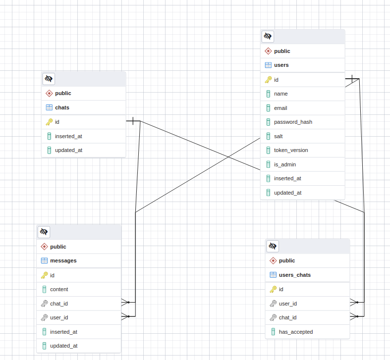

# SimpleChatApp

A simple chat application made with Elixir/Phoenix, PostgreSQL and React with Chakra UI  
Made by: [diderikk](https://github.com/diderikk)  
API-URL: [simple-chat-app.gigalixirapp.com/](https://simple-chat-app.gigalixirapp.com/)
API Documentation: [API-Docs](backend/docs/APIDOCS.md)

## Content
1. [Introduction](#introduction)
2. [Functionality](#functionality)
3. [Continous Integration](#continous-integration)
4. [ER diagram](#er-diagram)
5. [Deployment](#deployment)

## Introduction
SimpleChatApp is a full stack application I made for trying out Elixir/Phoenix as a API framework. Users are able to sign up and sign in. After signing in, the user can create new chats and invite other users. Currently not implemented a method for inviting users to existing chats. Chatting functionality is implemented using Phoenix Channels and websockets. The user must be authorized to enter a chat.

## Functionality
### Sign Up
* Requires
	* Username
	* Unique email (no verification)
	* Password
* Returns an access and refresh token

### Sign in

### Authentication
* JWT Token
	* Access token - 3 minutes
	* Refresh token - 4 days
	* Channel token - 3 minutes
* Access token sent with HTTP header (Authorization header)
* Refresh token sent as HTTP only cookie
* On access token expiration, new access token is sent if valid refresh token
* User stored with a token version that is incremented each time a new refresh token is created or logged out.
* If both tokens have expired, user is required to log in
* Channel token is used for accessing a given chat.
* Currently a user is not able to log out.

### Chat
* Chat page, shows a chats last 15 messages
* By scrolling up, older messages are retrieved from API (Pagination)
* On page load user if authorized retrieve a channel token
* Uses channel token to gain access to the chat channel
* If the above succeeds the user can chat via websockets
* API server keeps count of present/connected users, written under input bar

#### Chat page
 

### Chat list
* Chats into a invited tab and a chat tab
* User can accept or decline an invite to a chat
* Users can create new chats and add other users by email

#### Create chat and invite user
   

### Presence
* API server keeps track of present/connected users to a given channel
* When a user opens a chat page it connects to a websocket and is added to a presence list
* When a user leaves, it is removed from the presence list
* The list appears under the input bar
#### Present users (bottom grey text)

### Dashboard

## Continous Integration
Currently only implemented for backend. CI runs on every push to master branch. It starts a local PostgreSQL server to use as a test database. It then performs the unit/integration tests written in the /backend/test folder. Contains tests for all endpoints. These were used to create the API Endpoint documentation by using 
[elixir/bureaucrat](https://github.com/api-hogs/bureaucrat) => [API-Docs](backend/docs/APIDOCS.md)

## ER-diagram
#### Created with pgAdmin

## Deployment
### Backend
Hosted on [Gigalixir](https://www.gigalixir.com/). It creates a free PostgreSQL database, and automatically handles free Let's Encrypt TLS certificate.

### Frontend
Hosted on [Vercel](https://vercel.com/)

